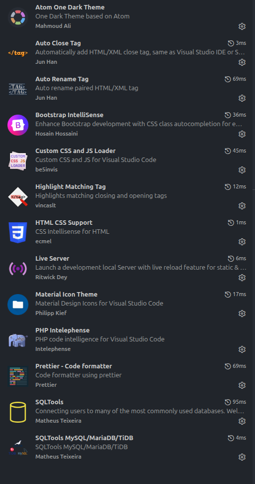

# VS Code Config

My personal VS Code configuration files.

## Files

| File | Description |
|------|-------------|
| `control.txt` | VS Code settings (editor, UI, fonts, extensions) |
| `keyboard.txt` | Custom keybindings with conditions |

## Setup

1. Copy settings from `control.txt` → `settings.json`
2. Copy keybindings from `keyboard.txt` → `keybindings.json`

### Locations

- **Settings**: `%APPDATA%\Code\User\settings.json` (Windows) or `~/.config/Code/User/settings.json` (Linux)
- **Keybindings**: `%APPDATA%\Code\User\keybindings.json` (Windows) or `~/.config/Code/User/keybindings.json` (Linux)

## Dependencies

- Theme: [Atom One Dark](https://marketplace.visualstudio.com/items?itemName=akamud.vscode-theme-onedark)
- Icons: [Material Icon Theme](https://marketplace.visualstudio.com/items?itemName=PKief.material-icon-theme)
- Formatter: [Prettier](https://marketplace.visualstudio.com/items?itemName=esbenp.prettier-vscode)
- Font: JetBrainsMono Nerd Font
